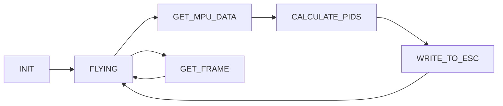
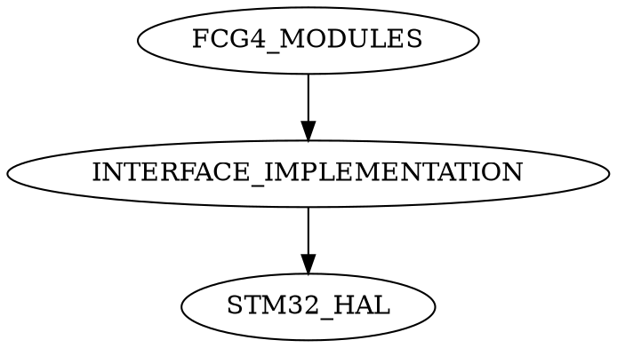

# FCG4-firmware
Firmware for flight controler FCG4( easyeda.com/dkowal308/fcg4), designated for race drones and rate mode flying. (**UNFINISHED PROJECT**)
#Data Flow <h1>

The processor communicates with the MPU over the SPI bus in the normal mode without using interrupts or the DMA mechanism. The PWM signal has a pulse duration of 125us to 250us, meeting the ONESHOT125 protocol standard used in many ESCs. IBUS is serial based protocol used by  2.4Ghz radio receivers produced by FLYSKY. 
#State machine <h2>

The selection of flight controller actions are based on the state machine. The program implements the following states:
* INIT- occurring only once at the very beginning of the flight, during which the microcontroller is initialized and objects are created in the program.
* FLYING- state to carry out activities such as: receiving data from rc receiver or checking drone arming status.
* GET FRAME - this state is set only when the whole IBUS packet is  received from the RC receiver. In this state, the packet is converted into individual channel values.
* GET MPU DATA - getting data from onboard MCU and converting it to degress per seconds for each axis.
* CALCULATE PIDS - calculating pid outputs for each ESCs.
* WRITE TO ESC- converting pid outputs to PWM signal and mixing values for quadcopter motors.
# Dependencies in program <h3>

The main program modules like moving average and pid controlers etc. are independent of the hardware configuration and can be used on any mcu. Modules using hardware resources of mcu require mplementation of appropriate methods in the "interface implemetation" module using the STM32 HAL library. 

